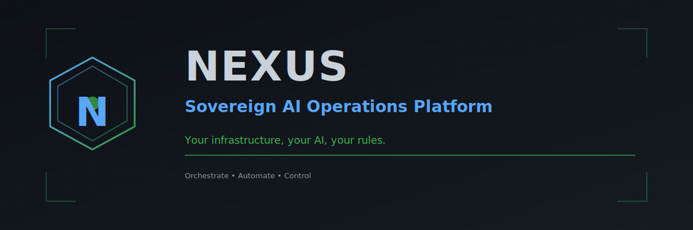

<h1 align="center">SmartMur AI Core</h1>

<p align="center">
  <strong>Self-hosted AI operations platform that runs your infrastructure.</strong><br/>
  Your hardware. Your AI. Your rules.
</p>

<p align="center">
  <a href="https://github.com/SmartMur/claude-superpowers/actions/workflows/ci.yml"></a>
  
  
  <a href="LICENSE"></a>
  
</p>

<p align="center">
  <a href="#quick-demo">Demo</a> &middot;
  <a href="#features">Features</a> &middot;
  <a href="#install">Install</a> &middot;
  <a href="#cli-reference">CLI</a> &middot;
  <a href="#comparison">Comparison</a> &middot;
  <a href="#contributing">Contributing</a>
</p>

---

### Why this?

- **Eight subsystems, one platform.** Skills, cron, messaging, SSH, browser automation, workflows, memory, and an encrypted vault -- integrated so a single YAML workflow can chain all of them.
- **AI-native, not AI-bolted.** Built for Claude Code from day one. 42 MCP tools, an intake pipeline that decomposes requests into skill graphs, and a memory store that auto-injects context into prompts.
- **Zero cloud dependencies.** Runs entirely on your hardware. No SaaS accounts required. Every credential stays in an age-encrypted local vault.

---

## Quick Demo

```
$ claw status
Subsystem        Status    Details
───────────────  ────────  ──────────────────────────
Skill Registry   OK        14 skills loaded
Cron Engine      OK        3 jobs scheduled
Messaging        OK        Telegram, Slack connected
SSH Fabric       OK        4 hosts in pool
Browser Engine   OK        Chromium headless ready
Workflow Engine  OK        14 workflows available
Memory Store     OK        127 facts, 24 preferences
Vault            OK        age-encrypted, 8 secrets

$ claw skill run heartbeat
[heartbeat] Pinging 6 hosts...
  proxmox.local     OK   1.2ms
  truenas.local     OK   0.8ms
  docker01.local    OK   1.1ms
  pihole.local      OK   0.9ms
[heartbeat] Probing 3 HTTPS services...
  grafana.local     OK   cert valid 142 days
  homeassistant     OK   cert valid 89 days
  proxmox:8006      OK   cert valid 364 days
Exit code: 0

$ claw cron list
ID   Schedule       Type    Name                  Last Run
──   ──────────     ─────   ────────────────────  ──────────────
1    0 7 * * *      skill   morning-brief         2026-03-06 07:00
2    */15 * * * *   skill   heartbeat             2026-03-06 09:45
3    0 2 * * 0      shell   backup-verify         2026-03-03 02:00

$ claw ssh proxmox "qm list"
VMID  NAME             STATUS   MEM(MB)  BOOTDISK(GB)
100   docker01         running  16384    120
101   truenas          running  32768    32
102   k3s-master       running  8192     60
```

---

## Features

Eight integrated subsystems, 42 MCP tools, 86 REST endpoints, 25 CLI command groups.

| Subsystem | What it does |
|-----------|-------------|
| **Skill System** | 14 built-in skills. Registry, loader, auto-install from templates, SkillHub sync. Sandboxed execution with vault access control. |
| **Cron Engine** | APScheduler + SQLite. Four job types: shell, claude, webhook, skill. Cron expressions, intervals, one-shot. Output routing to files or channels. |
| **Messaging Gateway** | Telegram, Slack, Discord, email, iMessage. Notification profiles fan out to multiple channels. Inbound messages trigger skills. |
| **SSH Fabric** | Paramiko connection pool with lazy creation and liveness probes. Multi-host execution, host groups, health checks. Home Assistant REST bridge. |
| **Browser Automation** | Playwright + headless Chromium. Persistent session profiles. Navigate, screenshot, extract tables, fill forms, evaluate JS. |
| **Workflow Engine** | YAML pipelines with five step types: shell, claude_prompt, skill, http, approval_gate. Conditions, rollback, notifications. 14 built-in workflows. |
| **Memory Store** | SQLite-backed persistent memory. Categories: fact, preference, project_context, conversation_summary. Full-text search. 90-day auto-decay. Context auto-injection into Claude prompts. |
| **Encrypted Vault** | age-encrypted credential store. Atomic writes. Rotation policies with warning/expired thresholds. Audit-logged. Sandboxed injection into skills. |

Plus: a FastAPI dashboard (86 REST endpoints, 21 routers, HTMX frontend), an MCP server (42 native Claude Code tools), an intake pipeline (natural language to skill graphs), file watchers, and an append-only audit log.

---

## The Compound Workflow

One YAML file. All eight subsystems. No other tool does this:

```yaml
name: morning-infrastructure-check
steps:
  - name: check-vms
    type: shell
    command: "claw ssh proxmox 'qm list'"

  - name: diagnose-issues
    type: claude_prompt
    prompt: "Analyze this VM list. Flag any stopped VMs that should be running."
    input_from: check-vms

  - name: screenshot-dashboard
    type: shell
    command: "claw browse screenshot https://proxmox.local:8006 --output /tmp/pve.png"

  - name: log-finding
    type: shell
    command: "claw memory remember 'morning-check' '{{ steps.diagnose-issues.output }}'"

  - name: alert-operator
    type: skill
    skill: heartbeat
    notify: critical

  - name: approve-restart
    type: approval_gate
    channel: telegram
    message: "VMs need restart. Approve?"

  - name: restart-vms
    type: shell
    command: "claw ssh proxmox 'qm start {{ vm_id }}'"
    condition: "steps.approve-restart.approved"
```

SSH executes. Claude reasons. The browser screenshots. Memory stores. Messaging delivers. The approval gate waits for human judgment. The vault secures every credential. Cron runs it at 7 AM.

---

## Architecture

```
                       You / Claude Code / Telegram Bot
                                  |
                       +----------+----------+
                       |    claw CLI (Click)  |
                       | claw-mcp (MCP/stdio) |
                       +----------+----------+
                                  |
     +-------+-------+----------+----------+-------+-------+-------+
     |       |       |          |          |       |       |       |
     v       v       v          v          v       v       v       v
  +------+ +-----+ +-----+ +------+ +-----+ +-----+ +-----+ +------+
  |Vault | |Skill| |Cron | | Msg  | | SSH | |Brow-| |Work-| |Memory|
  |(age) | |Reg. | |Eng. | |Gate- | |Fab- | |ser  | |flow | |Store |
  |      | |     | |     | | way  | | ric | |Eng. | |     | |      |
  +------+ +-----+ +-----+ +------+ +-----+ +-----+ +-----+ +------+
     |       |       |          |          |       |       |       |
     +-------+-------+----------+----------+-------+-------+-------+
                                  |
                       +----------+----------+
                       |  Config / .env       |
                       |  Audit log (JSONL)   |
                       |  File watchers       |
                       +---------------------+
                                  |
                  +---------------+---------------+
                  |               |               |
             Dashboard      Docker Compose   Telegram Bot
           (FastAPI+HTMX)   (5 services)    (AI responses)
            port 8200
```

### Docker Compose Stack

| Service | Port | Purpose |
|---------|------|---------|
| `redis` | 6379 | Pub/sub, cache, sessions |
| `msg-gateway` | 8100 | Multi-channel messaging API |
| `dashboard` | 8200 | Web UI + REST API |
| `browser-engine` | 8300 | Playwright automation API |
| `telegram-bot` | -- | Inbound message processing |

---

## Install

### Quick start

```bash
git clone https://github.com/SmartMur/claude-superpowers.git
cd claude-superpowers
python3 -m venv .venv && source .venv/bin/activate
pip install -e ".[dev]"
cp .env.example .env   # add your tokens
claw status
```

### Docker (full stack)

```bash
git clone https://github.com/SmartMur/claude-superpowers.git
cd claude-superpowers
cp .env.example .env   # add your tokens
docker compose up -d
```

Dashboard at `http://localhost:8200`. Browser engine at `http://localhost:8300`.

---

## CLI Reference

`claw` provides 25 command groups:

| Category | Commands | Description |
|----------|----------|-------------|
| **Core** | `skill`, `workflow`, `cron`, `memory`, `vault` | The eight subsystems |
| **Infrastructure** | `ssh`, `browse`, `msg`, `watcher` | Remote execution, browser, messaging, file monitoring |
| **Orchestration** | `intake`, `agent`, `orchestrate`, `dag`, `jobs` | Multi-agent dispatch, DAG execution, job management |
| **Operations** | `status`, `audit`, `report`, `benchmark`, `policy` | Monitoring, audit trail, reporting, safety policies |
| **Management** | `pack`, `template`, `setup`, `release`, `dashboard` | Bundles, config templates, setup wizard, releases |
| **System** | `daemon` | Cron daemon lifecycle (install/uninstall/status/logs) |

Run `claw <command> --help` for subcommand details.

---

## Comparison

### vs. Bare Scripts + Cron

| | SmartMur AI Core | Shell scripts |
|---|---|---|
| Credential management | age-encrypted vault with rotation | Plaintext in .env files |
| Scheduling | APScheduler, 4 job types, output routing | System crontab |
| Error handling | Rollback actions, approval gates | `set -e` and hope |
| Observability | Audit log, dashboard, status command | `grep` through logs |
| AI integration | Native Claude Code + MCP | None |

### vs. n8n

| | SmartMur AI Core | n8n |
|---|---|---|
| Interface | CLI + YAML + Claude Code | Visual drag-and-drop |
| AI integration | Claude-native (skills, MCP, prompts) | AI nodes (bolt-on) |
| SSH | Built-in pool with health checks | Per-execution SSH node |
| Credential management | age-encrypted vault with rotation | Built-in credential store |
| Integrations | 5 messaging channels + SSH + browser | 400+ nodes |
| Target user | Engineers who write code | Business users who drag nodes |

### vs. Ansible

| | SmartMur AI Core | Ansible |
|---|---|---|
| Scope | Full operations platform (SSH + cron + messaging + AI + browser) | Configuration management |
| AI reasoning | Claude analyzes output, makes decisions | None |
| Real-time response | Inbound message triggers, file watchers | Playbook runs only |
| Browser automation | Playwright with session persistence | None |
| Learning | Memory store retains context across runs | Stateless |

### vs. Agent Frameworks (LangChain, CrewAI)

| | SmartMur AI Core | Agent frameworks |
|---|---|---|
| Type | Ready-to-run platform | Libraries for building agents |
| Time to first result | `pip install && claw skill run heartbeat` | Write agent code, configure tools, deploy |
| Infrastructure awareness | SSH, Docker, Proxmox, Home Assistant | Cloud-agnostic abstractions |
| Production runtime | Cron, watchers, messaging, dashboard | You build the runtime |

---

## Built-in Skills

| Skill | Purpose |
|-------|---------|
| `heartbeat` | Ping hosts, probe HTTPS services, formatted status table |
| `network-scan` | Network discovery and port scanning |
| `ssl-cert-check` | TLS certificate expiry monitoring |
| `docker-monitor` | Container health checks across Docker hosts |
| `backup-status` | Backup job verification |
| `container-watchdog` | Container restart loop detection and alerting |
| `ops-report` | Operational status summary across all subsystems |
| `deploy` | Deployment pipeline: git pull, pip install, docker build, health check |
| `github-admin` | Repository audit, branch protection, security scanning |
| `tunnel-setup` | Cloudflare tunnel token management |
| `qa-guardian` | Code quality scanner: 12 checks across 4 categories |
| `infra-fixer` | Docker infrastructure auto-remediation (40+ containers) |
| `cloudflared-fixer` | Tunnel crash-loop detection and recovery |
| `workspace-intake-smoke` | Intake pipeline smoke test |

Create new skills: `claw skill create --name my-tool --type python`

---

## Contributing

See [CONTRIBUTING.md](CONTRIBUTING.md) for development setup, coding standards, and PR process.

```bash
# Run the test suite
PYTHONPATH=. pytest --ignore=tests/test_telegram_concurrency.py
```

Security issues: see [SECURITY.md](SECURITY.md).

---

## License

[MIT](LICENSE)

---

<p align="center">
  <sub>Sovereignty is not a feature. It is the architecture.</sub>
</p>
